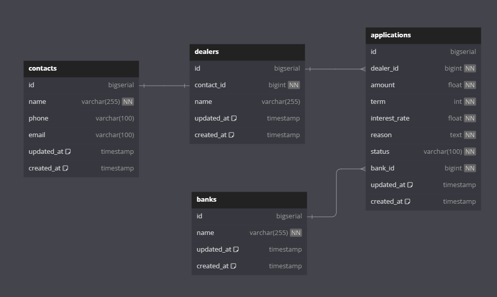
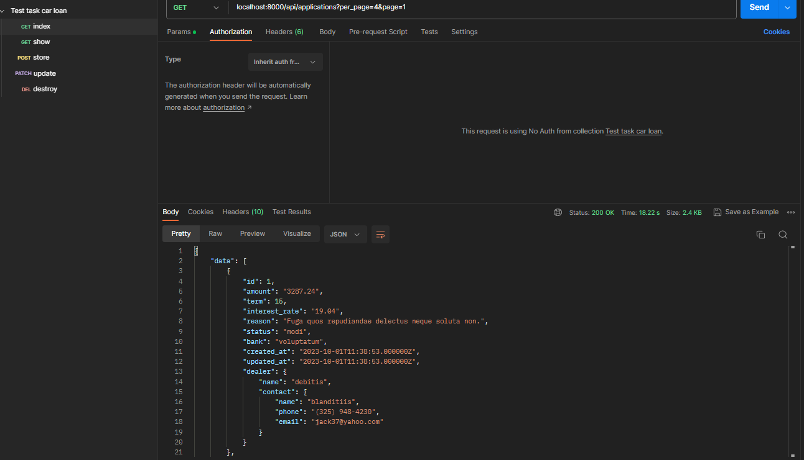

# laravel-cart-test-task

### Задание: [Task.pdf](Task.pdf)

``
Stack: Laravel, postgresql
``

### Database Schema



## Инструкция По Запуску:

```
1. Clone the repo
```

```
2. cd laravel-car-loan-api-test-task
```

```
3. cp .env.example .env
```

```
4. docker-compose build
```

```
5. docker-compose up -d
```

```
6. docker-compose run -it composer install 
```

```
7. docker-compose run -it app php artisan migrate --seed
```

#### Сервер доступен на 8000 порту

### Postman Collection
[postman.json](postman.json)

### Postman Preview


